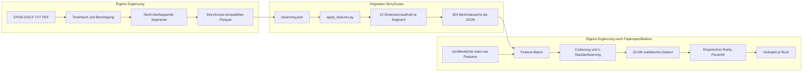

# Bookalyzer: technische Umsetzung auf Basis von StoryScope

## 1. Ziel

Bookalyzer analysiert mehrere Bücher eines Autors mit den veröffentlichten Werkzeugen und Daten aus **StoryScope: Investigating idiosyncrasies in AI fiction**. Das primäre Ergebnis ist ein Violinplot der narrativen Seltenheit je Buch.

Die Auswertung soll so nah wie mit den veröffentlichten Artefakten möglich an der Studie bleiben:

- dieselbe StoryScope-Taxonomie;
- dieselbe dimensionsweise Merkmalsextraktion;
- nach Möglichkeit dasselbe Extraktionsmodell und dieselbe Modellkonfiguration;
- derselbe Referenzraum aus `train + validation`;
- z-standardisierter codierter Merkmalsraum;
- euklidische Distanz zu den 25 nächsten Nachbarn;
- empirisches Rarity-Perzentil relativ zur Referenzverteilung.

Das Diagramm für Romane muss korrekt als **segment-level narrative rarity by book** bezeichnet werden. Die Studie analysiert vollständige Kurzgeschichten; Romansegmente sind eine dokumentierte methodische Anpassung.

## 2. Nicht-Ziele

- Kein Plagiatsnachweis.
- Kein Qualitäts- oder Originalitätsurteil.
- Keine erneute Induktion der Taxonomie aus den Büchern.
- Keine erneute Generierung der fünf KI-Vergleichskorpora.
- Kein Einsatz der XGBoost-Klassifikatoren für die Rarity-Berechnung. Figure 5 beruht auf Nachbarschaftsabständen, nicht auf Klassifikatorwahrscheinlichkeiten.
- Keine Behauptung einer exakten Reproduktion, solange die Reproduktionsprüfung in Abschnitt 12 nicht bestanden ist.

## 3. Quellen festschreiben

### 3.1 Paper

- arXiv: <https://arxiv.org/abs/2604.03136>
- Für die Implementierung maßgebliche Version: v4 vom 13. April 2026
- Rarity-Methode: Anhang G, Seite 22 der PDF

### 3.2 Offizieller Code

- Repository: <https://github.com/jenna-russell/storyscope>
- Zu Beginn verwendeter Commit: `642e746804e1ee4138ffdcf13b7412eb3dc2a70b`
- Lizenz: MIT

Den Commit unverändert unter `vendor/storyscope/` ablegen. Eigene Änderungen gehören ausschließlich in das Paket `bookanalyzer/`.

```powershell
git clone https://github.com/jenna-russell/storyscope.git vendor/storyscope
git -C vendor/storyscope checkout 642e746804e1ee4138ffdcf13b7412eb3dc2a70b
git -C vendor/storyscope status --short
```

Der letzte Befehl muss leer bleiben.

### 3.3 Offizielle Daten

- Dataset: <https://huggingface.co/datasets/jjrussell10/storyscope>
- Benötigte Dateien:
  - `stories_train.parquet`
  - `stories_val.parquet`
  - `stories_test.parquet`
  - `storyscope_features.parquet`
  - `taxonomy.json`

Die Dateien unter `data/reference/storyscope/` speichern. Für jede Datei SHA-256, Dateigröße und Downloadzeitpunkt in `data/reference/manifest.json` festhalten.

Die menschlichen Originalgeschichten werden nicht benötigt. Für den Referenzraum reichen die veröffentlichten Merkmalsvektoren und Splitinformationen.

## 4. Zielarchitektur



## 5. Empfohlene Projektstruktur

```text
Bookalyzer/
├─ IMPLEMENTATION.md
├─ pyproject.toml
├─ requirements.lock
├─ config/
│  ├─ analysis.yaml
│  ├─ models.yaml
│  └─ feature_sets.yaml
├─ vendor/
│  └─ storyscope/
├─ input/
│  └─ books/
├─ data/
│  ├─ reference/storyscope/
│  ├─ processed/book_segments.parquet
│  ├─ features/raw/
│  ├─ features/book_features.parquet
│  └─ cache/
├─ bookanalyzer/
│  ├─ __init__.py
│  ├─ cli.py
│  ├─ ingest.py
│  ├─ segment.py
│  ├─ storyscope_adapter.py
│  ├─ feature_matrix.py
│  ├─ paper_encoder.py
│  ├─ rarity.py
│  ├─ plots.py
│  └─ provenance.py
├─ tests/
│  ├─ test_ingest.py
│  ├─ test_segment.py
│  ├─ test_encoder.py
│  ├─ test_rarity.py
│  └─ test_reproduction.py
├─ reproduction/
│  ├─ metrics.json
│  └─ figure5.png
└─ outputs/
   ├─ data/
   ├─ figures/
   └─ report/
```

Rohtexte und rohe API-Antworten dürfen nicht in Git eingecheckt werden.

## 6. Laufzeitumgebung

Python 3.11 in einer isolierten virtuellen Umgebung verwenden. Die Bibliotheken des offiziellen Repositorys übernehmen und nur für Import, Tests und Ausgabe ergänzen.

Zusätzliche Pakete:

- `ebooklib` und `beautifulsoup4` für EPUB;
- `python-docx` für DOCX;
- `pypdf` oder `pdfplumber` für textbasierte PDFs;
- `pytest` für Tests;
- `joblib` für Encoder und Scaler;
- optional `krippendorff` für die Stabilitätsprüfung;
- optional FAISS für eine beschleunigte **exakte** Nachbarschaftssuche.

Nach erfolgreichem Pilotlauf eine Sperrdatei erzeugen und zusätzlich `pip freeze` in den Laufmetadaten speichern. Mindestversionen wie `numpy>=...` genügen nicht für reproduzierbare Ergebnisse.

## 7. Buchimport und Segmentierung

### 7.1 Textimport

Für jedes Buch werden mindestens diese Metadaten erfasst:

```text
book_id
book_title
source_file
language
chapter_index
chapter_title
segment_index
segment_id
word_count
text_sha256
```

Bereinigungsschritte:

1. Unicode auf NFC normalisieren.
2. Seitenzahlen, wiederholte Kopf- und Fußzeilen entfernen.
3. Inhaltsverzeichnis, Impressum und Werbung als Front- beziehungsweise Backmatter markieren und standardmäßig ausschließen.
4. Absatz- und Szenengrenzen erhalten.
5. Text nicht kleinschreiben und typografische Zeichen nicht vereinheitlichen.
6. Jede Transformation protokollieren.

Eingescannte PDFs werden nicht stillschweigend analysiert. Erst OCR durchführen und eine Stichprobe visuell prüfen.

### 7.2 Segmentierungsregeln

Die Studie arbeitet mit vollständigen Geschichten von ungefähr 5.000 Wörtern. Für Romane gilt deshalb:

- Ziel: 5.000 Wörter pro Segment;
- bevorzugter Bereich: 3.000 bis 7.000 Wörter;
- natürliche Kapitel- und Szenengrenzen bevorzugen;
- kurze benachbarte Abschnitte deterministisch zusammenfassen;
- lange Kapitel an Szenenwechseln teilen;
- keine überlappenden oder gleitenden Fenster;
- Reihenfolge und Herkunft jedes Segments erhalten;
- keine künstliche Zusammenfassung oder Ergänzung in den Segmenttext einfügen.

Für jedes Buch eine Segmentierungsvorschau mit Kapitel, Start-/Endposition und Wortzahl erzeugen. Die vollständige Merkmalsextraktion beginnt erst nach Prüfung dieser Vorschau.

### 7.3 StoryScope-Eingabeformat

`data/processed/book_segments.parquet` muss mindestens enthalten:

```text
prompt_id       fortlaufende stabile Ganzzahl
title           eindeutiger Segmenttitel
human_story     unveränderter Segmenttext
book_id
book_title
chapter_index
segment_index
word_count
```

`prompt_id` und `title` müssen über wiederholte Läufe stabil bleiben.

## 8. Merkmalsextraktion mit StoryScope

Nur Stage 5 des veröffentlichten Projekts wird benötigt:

```powershell
$env:PYTHONPATH = "vendor/storyscope"

python -m storyscope.5_feature_application.apply_features `
  --csv data/processed/book_segments.parquet `
  --taxonomy vendor/storyscope/data/taxonomy.json `
  --output-dir data/features/raw `
  --config config/models.yaml `
  --sources human `
  --parallel 4 `
  --dim-workers 5 `
  --resume
```

Der Originalcode führt pro Segment zehn dimensionsweise Aufrufe aus. Diese Aufteilung beibehalten; keine Single-Shot-Extraktion verwenden.

### 8.1 Modellkonfiguration

Für maximale Nähe zur Studie:

```yaml
pipeline:
  feature_application:
    provider: vertex
    model: gemini-3-flash-preview
    max_tokens: 65536
```

Zusätzlich:

- JSON-Antwortmodus verwenden;
- niedrige Temperatur wie im Originalcode beibehalten;
- minimalen Thinking-Modus konfigurieren, sofern der verwendete API-Endpunkt dies unterstützt;
- Modell-ID, Provider, Region und Antwortmetadaten pro Lauf speichern;
- bei nicht verfügbarem Modell abbrechen und eine Ersatzentscheidung dokumentieren;
- niemals unbemerkt auf ein anderes Modell ausweichen.

Die Übertragung unveröffentlichter Manuskripte an Vertex AI setzt die ausdrückliche Freigabe des Rechteinhabers voraus. Ohne Freigabe nur Import und Segmentierung durchführen. Ein lokales Ersatzmodell ist möglich, gilt aber nicht als papernahe Reproduktion.

### 8.2 Ausgabevalidierung

Jede Segmentdatei muss enthalten:

- stabile Segment-ID;
- Modell-ID;
- 304 erwartete Feature-IDs oder eine vollständige Fehlerliste;
- Werte aus den zulässigen Taxonomiewerten;
- Laufzeit- und Wiederaufnahmeinformationen.

Unbekannte Werte dürfen nicht stillschweigend neue Kategorien erzeugen. Normalisierungsentscheidungen protokollieren.

## 9. Feature-Sets

Folgende Varianten getrennt berechnen:

| Name | Umfang | Status |
|---|---:|---|
| `full_304` | 304 | vollständig aus veröffentlichten Artefakten rekonstruierbar |
| `public_nonstyle_265` | 265 | alle 39 Features der Dimension `style` entfernt |
| `paper_narrative_257` | 257 | exakt erst nach Vorliegen der acht zusätzlichen ausgeschlossenen Feature-IDs |

Das Paper entfernt neben der kompletten Style-Dimension acht weitere als stilabhängig eingestufte Features. Diese acht IDs sind im veröffentlichten `taxonomy.json` nicht markiert.

Regeln:

1. Die acht IDs nicht raten.
2. Wenn sie nicht von den Autoren oder aus einem weiteren offiziellen Artefakt beschafft werden können, `paper_narrative_257` als blockiert markieren.
3. Diagramme müssen das tatsächlich verwendete Feature-Set nennen.
4. `public_nonstyle_265` ist die bevorzugte vollständig nachvollziehbare öffentliche Variante.

## 10. Paper-kompatible Codierung

Den veröffentlichten `feature_encoder.py` nicht ungeprüft für die Rarity-Reproduktion verwenden. Der aktuelle Helfer label-codiert mehrere Featuretypen anders als die Paperspezifikation.

`bookanalyzer/paper_encoder.py` implementiert ausdrücklich:

- kategorisch: One-hot;
- binär: One-hot;
- Multi-Select: Multi-hot über einzelne zulässige Werte;
- ordinal: Ganzzahl nach der Reihenfolge der Taxonomiewerte;
- Skala: numerischer Wert;
- `n/a`: vorab definierte, dokumentierte Behandlung;
- unbekannte Werte: Fehler, kein automatisches Erweitern des Vokabulars.

Den Encoder ausschließlich auf dem gepoolten StoryScope-`train + validation`-Korpus fitten. Anschließend unverändert auf Testdaten und Buchsegmente anwenden.

Persistieren:

```text
data/cache/encoder.json
data/cache/feature_columns.json
data/cache/scaler.joblib
data/cache/reference_matrix.npy
```

### 10.1 Dimensionsprüfungen

Das Paper nennt folgende Zielgrößen:

- `Narrative + Style`: 1.108 codierte Spalten;
- `Narrative`: 958 codierte Spalten;
- `Style Only`: 129 codierte Spalten.

Die veröffentlichten Modellgewichte und der aktuelle Repository-Encoder weichen davon ab. Deshalb sind diese Zahlen Reproduktionsziele und keine Werte, die durch Auffüllen oder Entfernen von Spalten erzwungen werden dürfen. Jede Abweichung in `reproduction/metrics.json` dokumentieren.

### 10.2 Standardisierung

`StandardScaler` ausschließlich auf den codierten `train + validation`-Zeilen fitten. Mittelwerte und Standardabweichungen persistieren. Testdaten und Buchsegmente nur transformieren.

Spalten mit Varianz null müssen deterministisch behandelt und protokolliert werden.

## 11. Rarity-Berechnung

### 11.1 Referenzraum

Der papergetreue Referenzraum besteht aus allen sechs Quellen im gepoolten `train + validation`-Split.

Für jeden Referenzpunkt:

1. die 26 nächsten Treffer suchen;
2. den Punkt selbst entfernen;
3. die euklidischen Distanzen der verbleibenden 25 Nachbarn mitteln.

Für Test- oder Buchsegmente direkt die 25 nächsten Referenzpunkte verwenden.

```text
raw_rarity(x) = mean(euclidean_distance(x, NN_25(x)))
```

Keine Dimensionsreduktion vor der Distanzberechnung verwenden. LDA, PCA oder UMAP sind ausschließlich für separate Visualisierungen zulässig.

### 11.2 Exakte Nachbarschaftssuche

Primär eine exakte Suche verwenden:

- FAISS `IndexFlatL2`, wenn eine passende Umgebung verfügbar ist;
- andernfalls blockweise exakte Distanzen mit NumPy beziehungsweise scikit-learn.

HNSW oder andere approximative Verfahren dürfen nicht die Reproduktionsmetriken erzeugen. Sie sind nur als separat gekennzeichnete Beschleunigungsvariante zulässig und müssen gegen eine exakte Stichprobe auf Recall geprüft werden.

Die Referenz-Rarity-Verteilung einmal berechnen und cachen.

### 11.3 Perzentile

Das Perzentil eines Rohwertes ist seine Position in der empirischen `train + validation`-Rarity-Verteilung:

```text
rarity_percentile(x) = ECDF_reference(raw_rarity(x))
```

Die Tie-Behandlung einmal festlegen, testen und im Manifest speichern. Werte im Bereich `[0, 1]` ausgeben.

Zusätzliche, klar getrennte Varianten sind erlaubt:

- Human-only-Referenzraum;
- interner Referenzraum aus den übrigen Buchsegmenten.

Sie dürfen nicht mit der papergetreuen gepoolten Variante vermischt werden.

## 12. Reproduktion von Figure 5 als Qualitätstor

Vor der Analyse eigener Bücher Figure 5 auf den veröffentlichten Testdaten rekonstruieren.

Prüfschritte:

1. Referenz: gepooltes `train + validation`.
2. Auswertung: ausschließlich `test`.
3. Feature-Set und Encoder vollständig protokollieren.
4. `k = 25`, euklidische Distanz, z-standardisierter codierter Raum.
5. Violinplot nach Quelle erzeugen.
6. Durchgezogene Linie für Mittelwert, gestrichelte Linie für Median.

Vom Paper berichtete Orientierungswerte:

- Human: mittleres Rarity-Perzentil ungefähr `0,71`;
- alle KI-Quellen zusammen: ungefähr `0,49`.

Ausgaben:

```text
reproduction/figure5.png
reproduction/figure5.svg
reproduction/test_rarity.parquet
reproduction/metrics.json
reproduction/README.md
```

### 12.1 Abnahmeregel

- **Exact reproduction:** nur bei identischem Feature-Set, kompatibler Codierung und hinreichend nahen Referenzmetriken.
- **Public-artifacts reconstruction:** wenn aufgrund fehlender acht Feature-IDs oder Encoderartefakte eine dokumentierte Abweichung bleibt.
- Bei fehlgeschlagener Reproduktion dürfen Buchergebnisse erzeugt werden, müssen aber im Titel und Bericht als Rekonstruktion gekennzeichnet sein.

## 13. Analyse eigener Bücher

Nach bestandenem Qualitätstor:

1. Buchsegmente mit demselben Modell und derselben Taxonomie extrahieren.
2. Mit dem bereits gefitteten Encoder transformieren.
3. Mit dem bereits gefitteten Scaler z-standardisieren.
4. Für jedes Segment die 25 nächsten StoryScope-Referenzpunkte bestimmen.
5. Rarity-Rohwert und Perzentil berechnen.
6. Ergebnisse mit Buch-, Kapitel- und Segmentmetadaten zusammenführen.

Zentrale Ergebnistabelle:

```text
book_id
book_title
chapter_index
segment_index
segment_id
word_count
feature_set
raw_rarity
rarity_percentile
nearest_source_counts
extraction_model
run_id
```

## 14. Diagramme

### 14.1 Hauptdiagramm

Violinplot mit:

- x-Achse: Buch;
- y-Achse: Rarity-Perzentil gegenüber StoryScope `train + validation`;
- eine Beobachtung je nicht überlappendem Segment;
- durchgezogene Linie: Mittelwert;
- gestrichelte Linie: Median;
- Segmentzahl `n` je Buch sichtbar;
- Feature-Set und Referenzraum im Untertitel;
- korrekte Bezeichnung: `Per-segment narrative rarity by book`.

Dateien als PNG und SVG speichern. Die zugrunde liegenden Werte zusätzlich als CSV beziehungsweise Parquet ausgeben.

### 14.2 Ergänzende Diagramme

- Rarity entlang der Kapitelreihenfolge;
- Heatmap der mittleren Featureabweichungen je Buch;
- Buch-zu-Buch-Distanzmatrix;
- LDA- oder PCA-Projektion als separate Visualisierung;
- Liste der seltensten Segmente mit nächstgelegenen Referenzquellen.

Diese Diagramme dürfen die hochdimensionale Distanzberechnung nicht ersetzen.

## 15. Stabilität und Validierung

### 15.1 Extraktionsstabilität

Vor dem Gesamtlauf eine geschichtete Stichprobe von Segmenten mehrfach extrahieren. Analog zur Studie kann die Übereinstimmung mit Krippendorffs Alpha gemessen werden.

Mindestens prüfen:

- verschiedene Bücher;
- kurze und lange Segmente;
- Dialog-, Action- und Reflexionspassagen;
- Anfang, Mitte und Ende eines Romans.

Modell, Temperatur und Prompt bleiben über Wiederholungen identisch.

### 15.2 Manuelle Plausibilitätsprüfung

Für eine kleine Stichprobe ein Prüfformular mit Featurefrage, zulässigen Antworten, Modellantwort und Textbeleg erzeugen. Besonders prüfen:

- chronologische Diskontinuität;
- moralische Ambivalenz;
- thematische Explizitheit;
- Plotabschluss;
- Zahl und Eigenständigkeit von Nebenhandlungen;
- Eskalation;
- Perspektive und Figureninteriorität.

### 15.3 Sprach- und Domänengrenze

Der Referenzkorpus besteht aus englischer Literatur. Deutschsprachige Bücher werden im Original analysiert, nicht automatisch übersetzt. Die externe StoryScope-Rarity ist daher explorativ. Parallel eine interne, sprachkonsistente Rarity über die eigenen Bücher ausgeben.

## 16. Provenienz und Wiederholbarkeit

Jeder Lauf erhält eine `run_id` und ein maschinenlesbares Manifest mit:

```text
Zeitpunkt
Git-Commit von Bookalyzer
StoryScope-Commit
SHA-256 aller Eingaben und Referenzdateien
Python- und Paketversionen
Feature-Set
Modell-ID und Provider
Prompt- und Taxonomie-Hash
Segmentierungsparameter
Encoder- und Scaler-Hash
k und Distanzmetrik
Perzentilmethode
Ausgabe-Hashes
```

Rohe Feature-JSONs cachen. Ein erneuter Plotlauf darf keine neuen API-Aufrufe benötigen.

## 17. Vorgeschlagene CLI

```powershell
# 1. Dateien inventarisieren und Texte extrahieren
python -m bookanalyzer ingest --input input/books --output data/processed

# 2. Segmentierungsvorschau erzeugen
python -m bookanalyzer segment --config config/analysis.yaml --preview

# 3. Referenzdaten und Encoder aufbauen
python -m bookanalyzer build-reference --feature-set public_nonstyle_265

# 4. Figure 5 rekonstruieren
python -m bookanalyzer reproduce-figure5 --feature-set public_nonstyle_265

# 5. Kleinen API-Pilot ausführen
python -m bookanalyzer extract --pilot 6 --resume

# 6. Vollständig extrahieren
python -m bookanalyzer extract --resume

# 7. Rarity berechnen
python -m bookanalyzer rarity --feature-set public_nonstyle_265

# 8. Diagramme und Bericht erstellen
python -m bookanalyzer report
```

Jeder Befehl muss bei unvollständigen oder inkompatiblen Artefakten mit einer klaren Fehlermeldung abbrechen.

## 18. Tests

Mindestens folgende automatisierte Tests implementieren:

- EPUB-, DOCX-, TXT- und PDF-Import mit kleinen Fixtures;
- stabile Segment-IDs über wiederholte Läufe;
- keine Überlappung und keine Textverluste bei Segmenten;
- alle Taxonomie-IDs genau einmal in der Feature-Matrix;
- ordinale Werte folgen der Taxonomiereihenfolge;
- unbekannte Kategorien erzeugen einen Fehler;
- Scaler wird nur auf `train + validation` gefittet;
- Selbsttreffer werden bei Referenz-kNN entfernt;
- `k = 25` wird eingehalten;
- Perzentile liegen in `[0, 1]`;
- Plotmittelwerte und Plotmediane stimmen mit der Ergebnistabelle überein;
- ein Bericht lässt sich vollständig aus gecachten Daten neu erzeugen.

```powershell
pytest -q
```

## 19. Umsetzungsreihenfolge

1. Projektgerüst und gesperrte Umgebung erstellen.
2. StoryScope-Commit und Referenzdaten spiegeln und hashen.
3. Importer und deterministische Segmentierung implementieren.
4. Offiziellen Stage-5-Aufruf über einen Adapter integrieren.
5. Feature-JSONs validieren und in Parquet überführen.
6. Paper-Encoder und Feature-Set-Konfiguration implementieren.
7. Referenzmatrix, Standardisierung und exakte 25-NN-Rarity implementieren.
8. Figure 5 rekonstruieren und Abweichungen dokumentieren.
9. Kleinen Buch-Pilot durchführen und Stabilität prüfen.
10. Erst danach alle Bücher analysieren.
11. Diagramme, Rohdaten und Methodenbericht erzeugen.

## 20. Definition of Done

Die erste belastbare Version ist fertig, wenn:

- alle Eingabebücher reproduzierbar importiert und segmentiert werden;
- die Segmentierung manuell geprüft wurde;
- der offizielle StoryScope-Feature-Application-Code verwendet wird;
- alle API-Antworten validiert und gecacht werden;
- Referenzdaten, Encoder und Scaler versioniert sind;
- Figure 5 reproduziert oder die verbleibende Abweichung vollständig dokumentiert ist;
- jedes Buch einen Violinplot mit nachvollziehbaren Segmentwerten besitzt;
- CSV/Parquet-Werte, PNG/SVG-Diagramme und ein Methodenbericht vorliegen;
- jeder Ergebniswert über `run_id`, Segment-ID und Manifest zurückverfolgt werden kann;
- die Resultate ausdrücklich als statistische Rarity und nicht als Qualitäts-, Plagiats- oder Originalitätsurteil beschrieben werden.
