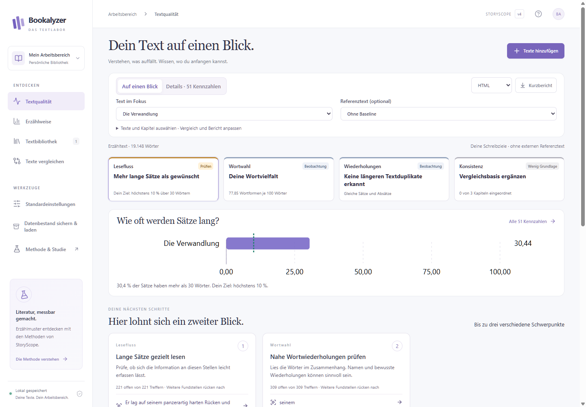
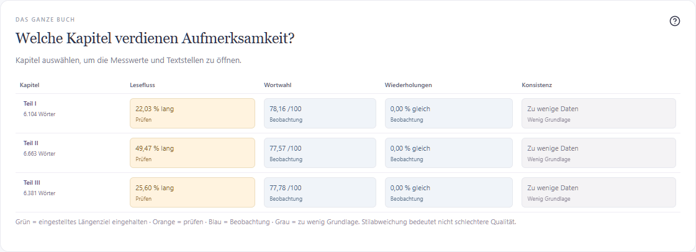
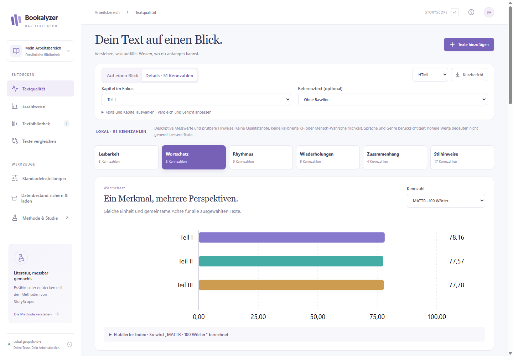

# Bookalyzer [](https://github.com/openai/codex)

**Ein lokales Textlabor für Bücher und Manuskripte.**

Bookalyzer macht Sprachmuster sichtbar: Wie lang sind die Sätze? Welche Wörter
wiederholen sich? Wo verändert sich der Rhythmus zwischen Kapiteln? Die Desktop-App
verbindet verständliche Übersichten mit konkreten Textstellen, Diagrammen und
nachvollziehbaren Kennzahlen. Du entscheidest, welche Auffälligkeiten du überarbeiten
möchtest und welche zu deinem Stil gehören.



<p align="center"><sub>Echte lokale Analyse von Franz Kafkas gemeinfreier Erzählung <em>Die Verwandlung</em>. Die Oberfläche ist auf Deutsch.</sub></p>

## Was du damit machen kannst

| Aufgabe | In Bookalyzer |
| --- | --- |
| Einen Text untersuchen | TXT, DOCX, EPUB oder textbasiertes PDF importieren und lokal analysieren. |
| Auffälligkeiten verstehen | Lesefluss, Wortwahl, Wiederholungen und Konsistenz mit Fundstellen und Hinweisen betrachten. |
| Kapitel vergleichen | Alle Kapitel in einer Matrix überblicken und Unterschiede im Textverlauf erkennen. |
| Überarbeitungen vergleichen | Eine feste Baseline speichern und andere Texte oder Kapitel daran messen. |
| Genauer nachsehen | 51 lokale Kennzahlen mit Erklärungen, Formeln und Grenzen öffnen. |
| Ergebnisse mitnehmen | Kurzberichte und detaillierte Auswertungen als HTML, PDF, CSV oder JSON exportieren; die Bibliothek als ZIP sichern. |

Die Kennzahlen beschreiben den Text. Sie sind kein objektives Urteil über seine
literarische Qualität und kein Nachweis von KI-Autorschaft oder Plagiaten.

## Ein Blick in die App

### Kapitel im Zusammenhang

Die Kapitelübersicht zeigt, wo sich ein Text verändert. Schreibziele und konkrete
Fundstellen helfen dabei, diese Unterschiede einzuordnen.



### Vom Überblick zu den Kennzahlen

Unter **Details** kannst du einzelne Maße untersuchen, mehrere Kapitel vergleichen
und die zugehörigen Textstellen lesen.



Die Screenshots stammen aus einer abgeschlossenen Analyse, ohne Modellaufrufe.
Quelle, Aufbereitung und Anleitung zum Nachstellen: [README-Demo](docs/demo.md).

## Loslegen

1. **Texte hinzufügen** öffnen und eine Datei auswählen oder Text einfügen.
2. Sprache und Schreibziel wählen; für Kapitelvergleiche **Kapitel erkennen** aktivieren.
3. Importvorschau prüfen und die **lokale Analyse** starten.
4. Unter **Textqualität** den Überblick lesen, Fundstellen öffnen oder zu **Details** wechseln.

**Windows:** Ein selbst gebauter Installer enthält die komplette Analyse-Laufzeit.
**macOS:** Das mitgelieferte Bauskript erstellt eine DMG für Apple Silicon oder Intel.
Die native macOS-Version muss auf einem Mac gebaut und geprüft werden; eine hier
verifizierte DMG wird derzeit nicht angeboten. Die vollständigen Anleitungen stehen
in [DESKTOP.md](DESKTOP.md) und [MAC_INSTALL.md](MAC_INSTALL.md).

### Aus dem Quellcode starten

Voraussetzungen: **Python 3.11**, **Node.js 22** und **Git**. Das Submodul enthält
den unveränderten StoryScope-Code und seine öffentlichen Artefakte.

```sh
git clone --recurse-submodules https://github.com/PaulFreund/Bookalyzer.git
cd Bookalyzer
```

Unter Windows / PowerShell:

```powershell
py -3.11 -m venv .venv
.\.venv\Scripts\python.exe -m pip install -r requirements.lock
npm ci
npm start
```

Unter macOS / Linux:

```sh
python3.11 -m venv .venv
.venv/bin/python -m pip install -r requirements.lock
npm ci
npm start
```

Die lokale Analyse benötigt keinen API-Schlüssel und keine Codex-Anmeldung.
Linux ist als Quellcode-Start vorgesehen; native Pakete werden für Windows und macOS gebaut.

## Lokal analysieren, optional die Erzählstruktur ergänzen

| | Lokale Textanalyse | StoryScope mit Codex |
| --- | --- | --- |
| Untersucht | Sprache, Satzbau, Wortvielfalt, Wiederholungen und Konsistenz | Narrative Merkmale wie Zeitstruktur, Ereignisse, Perspektive und Nebenhandlungen |
| Verarbeitung | Auf dem eigenen Rechner, nach der Installation auch offline | Über eine bereits angemeldete Codex CLI |
| Textübertragung | Keine | Segmenttexte werden nach ausdrücklicher Freigabe an OpenAI gesendet |
| Ergebnis | 51 Kennzahlen, Textstellen und Kapitelvergleiche | Explorative Merkmalsprofile und interne Vergleiche im StoryScope-Merkmalsraum |

StoryScope ist eine optionale Erweiterung. Die lokalen Ansichten funktionieren
unabhängig davon. Narrative Seltenheit beschreibt statistische Distanz und bewertet
weder Qualität noch Originalität. Die veröffentlichten Referenzartefakte bestehen
die Kompatibilitätsprüfung derzeit nicht; externe StoryScope-Perzentile und eine
exakte Reproduktion werden deshalb nicht behauptet. Die Desktop-App zeigt interne
Vergleiche und verfügbare deskriptive Referenzprofile.

## Daten und Nachvollziehbarkeit

- Eigene Bücher, extrahierte Texte, Modellantworten, Bibliotheken und erzeugte Berichte bleiben außerhalb der versionierten Dateien.
- Die Bibliothek lässt sich über **Datenbestand sichern & laden** exportieren und wiederherstellen.
- Die README verwendet ausschließlich das gemeinfreie Beispielbuch. Auch dessen Download und Analysedaten landen im ignorierten Ausgabeordner.
- Formeln, Voraussetzungen und Einschränkungen sind in [QUALITY_METHODS.md](QUALITY_METHODS.md) dokumentiert.

## Entwickeln und weiterführende Dokumentation

```sh
npm test
npm run build
npm run test:comparisons
npm run test:pdf
```

| Dokument | Inhalt |
| --- | --- |
| [Desktop-Anleitung](DESKTOP.md) | Bedienung, Datenbestand, Exporte und native Builds |
| [macOS-Anleitung](MAC_INSTALL.md) | DMG bauen und installieren |
| [README-Demo](docs/demo.md) | Gemeinfreies Beispiel und reproduzierbare Analyse |
| [Qualitätsmethoden](QUALITY_METHODS.md) | Alle lokalen Kennzahlen und ihre Grenzen |
| [Technische Umsetzung](IMPLEMENTATION.md) | StoryScope-Pipeline, Referenzraum und Provenienz |
| [Reproduktionsstatus](reproduction/README.md) | Befunde zur Kompatibilität der öffentlichen StoryScope-Artefakte |

Grundlage der optionalen narrativen Analyse:
[StoryScope-Paper](https://arxiv.org/abs/2604.03136),
[Originalcode](https://github.com/jenna-russell/storyscope) und
[veröffentlichte Daten](https://huggingface.co/datasets/jjrussell10/storyscope).
